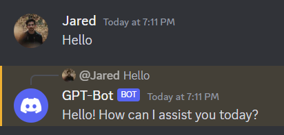

# Discord Chatbot with OpenAI Integration

This Discord chatbot integrates with the OpenAI API to provide responses based on a conversation history. The bot listens to messages in specified channels and responds to user interactions.



## Getting Started

Follow these steps to set up and run the bot:

### Prerequisites

Before you begin, ensure you have the following prerequisites:

- Node.js and npm installed on your system
- A Discord bot token (obtained by creating a bot on the [Discord Developer Portal](https://discord.com/developers/applications))
- An OpenAI API key for authentication

## Installation

To install and configure your Discord Chatbot with OpenAI Integration, follow these steps:

1. **Navigate to the project directory:**

   Open your terminal or command prompt and navigate to the directory where you've cloned or saved your project files. Ensure that you are in the root directory of your project.

2. **Install the required Node.js dependencies:**

   Run the following command to install the necessary Node.js packages and dependencies:

   ```bash
   npm init -y
   npm install discord.js dotenv openai

3. **Add your Discord bot token and OpenAI API key:**

   Edit the .env file and add the following lines, replacing your-discord-bot-token and your-openai-api-key with your actual Discord bot token and OpenAI API key:
   - DISCORD_TOKEN=your-discord-bot-token
   - OPENAI_KEY=your-openai-api-key


4. **Add Channels for Bot to interact on:**

   - Copy Channel ID in discord
   - Navigate to the CHANNELS variable
   - Paste in the channel ID
   - You can modify the IGNORE_PREFIX variable to specify a different prefix for commands or to ignore messages starting with a different character.

5. **Discord Setup**  

   - Navigate to https://discord.com/developers/applications
   - Under the applications tab click New Application
   - Give the new application a name
   - Navigate to settings then the bot tab
   - Deselect Public Bot
   - Select the three options under Privileged Gateway Intents: Presence, Server Memebers, Message Content
   - Under the OAuth2 tab navigate to URL Generator
   - In the scopes section check: bot and applications.commands
   - In the bot permissions check: send messages
   - At the bottom of the page click copy on the generated url
   - Paste url into channel to set up the chat bot
   - When running node index.js the bot will go online and interactive on discord